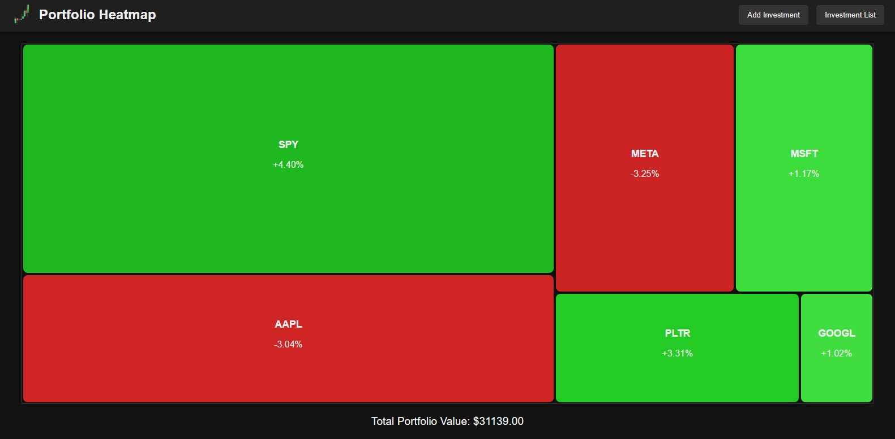

# Portfolio Heatmap

Portfolio Heatmap is an interactive web-based dashboard that visualizes your investment portfolio using a dynamic treemap layout. Each investment is represented by a tile whose area is proportional to its value, and the tiles display the daily percentage change along with detailed information on hover.

## Features

- **Dynamic Treemap Layout:**  
  Tiles are arranged in a fixed rectangular container using a slice-and-dice treemap algorithm. Each tile’s area is proportional to the value of the investment.

- **Interactive Investment Tiles:**  
  - **Default View:** Displays the stock ticker and daily percentage change.
  - **Hover View:** Reveals detailed information including the number of shares, average price, total investment value, and provides edit/delete buttons.

- **Investment Management:**  
  Easily add, edit, or remove investments through a user-friendly interface.

- **Persistent Data:**  
  Uses browser localStorage to retain your portfolio data across sessions.

- **Responsive & Modern Design:**  
  Features a sleek dark theme with a fixed container that adapts to the viewable area of your screen, ensuring an engaging experience on any device.

## Screenshot




## Installation

1. **Clone the repository:**

   ```bash
   git clone https://github.com/yourusername/portfolio-heatmap.git

2. **Double click on the index.html file to open the project in your web browser**

## Future features

1. **Live stock data**

2. **Portfolio performance visualizations**

3. **Multiple time frames for analysis**

4. **Cloud based deployment and user account features**

5. **Abandon local storage in favor of database**
